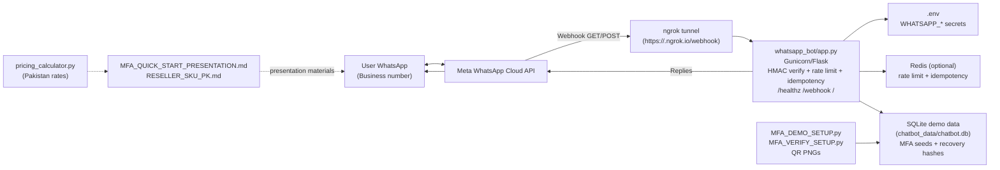

# Architecture (MFA + WhatsApp Bot)

```mermaid
flowchart LR
    UserPhone["User WhatsApp\n(Business number)"]
    MetaAPI["Meta WhatsApp Cloud API"]
    Ngrok["ngrok tunnel\n(https://<id>.ngrok.io/webhook)"]
    Bot["whatsapp_bot/app.py\nGunicorn/Flask\nHMAC verify + rate limit + idempotency\n/healthz /webhook /"]
    Redis["Redis (optional)\nrate limit + idempotency"]
    Env[".env\nWHATSAPP_* secrets"]
    DB["SQLite demo data\n(chatbot_data/chatbot.db)\nMFA seeds + recovery hashes"]
    MFASeed["MFA_DEMO_SETUP.py\nMFA_VERIFY_SETUP.py\nQR PNGs"]
    Pricing["pricing_calculator.py\n(Pakistan rates)"]
    Docs["MFA_QUICK_START_PRESENTATION.md\nRESELLER_SKU_PK.md"]

    UserPhone <--> MetaAPI
    MetaAPI -->|Webhook GET/POST| Ngrok --> Bot
    Bot -->|Replies| MetaAPI --> UserPhone
    Bot --> Env
    Bot --> Redis
    MFASeed --> DB
    Bot --> DB
    Pricing -.-> Docs
    Docs -.presentation materials.-> UserPhone
```
