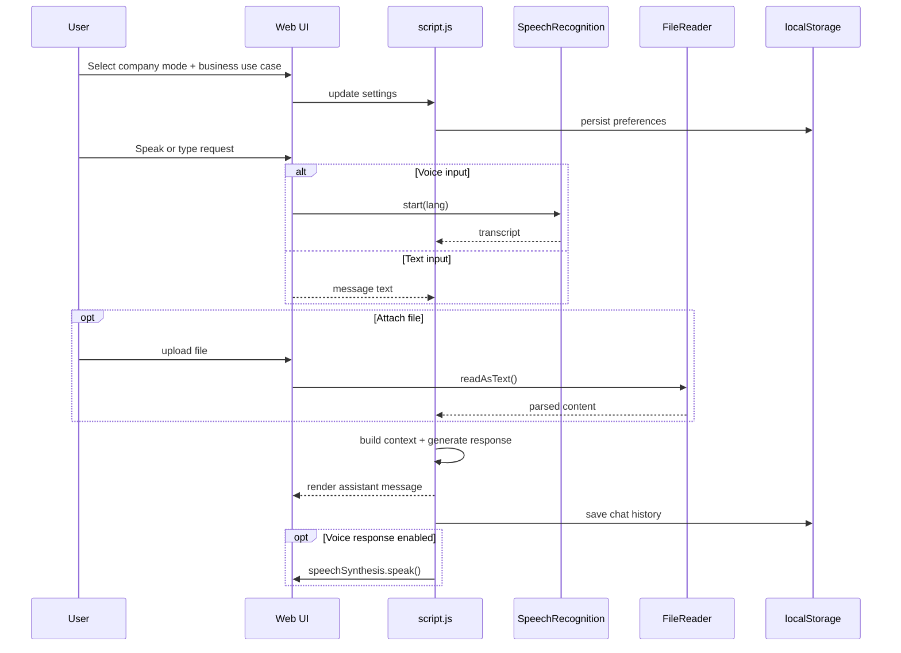

# Current Workflow Diagrams (V1)

## 1) Functional Flow
```mermaid
flowchart TD
    U[User] --> UI[Web UI<br/>web/index.html]
    UI --> JS[Client Logic<br/>web/js/script.js]

    subgraph Inputs
      T[Text Input]
      V[Voice Input<br/>SpeechRecognition]
      F[File Upload<br/>FileReader]
      S[Settings<br/>Company Mode + Business Use Case + Language]
    end

    T --> JS
    V --> JS
    F --> JS
    S --> JS

    JS --> Ctx[Session Context in Browser<br/>chatHistory + attachedFiles + preferences]
    Ctx --> Engine[Response Engine<br/>generateAIResponse()]
    Engine --> Msg[Chat Messages Render]
    Engine --> VoiceOut[Optional Voice Output<br/>speechSynthesis]
    Msg --> Export[Export Chat (.md)]
    Msg --> Hist[History Snapshot]

    JS --> LS[localStorage]
    LS --> Ctx

    subgraph Business Workflows
      BW1[Inventory / Remaining Items]
      BW2[Customer Messaging<br/>price, order, payment]
      BW3[Owner Alerts<br/>low stock, pending actions, daily summary]
      BW4[Proposal / Packaging for Sales]
    end

    Engine --> BW1
    Engine --> BW2
    Engine --> BW3
    Engine --> BW4
```

## 2) Runtime Sequence

